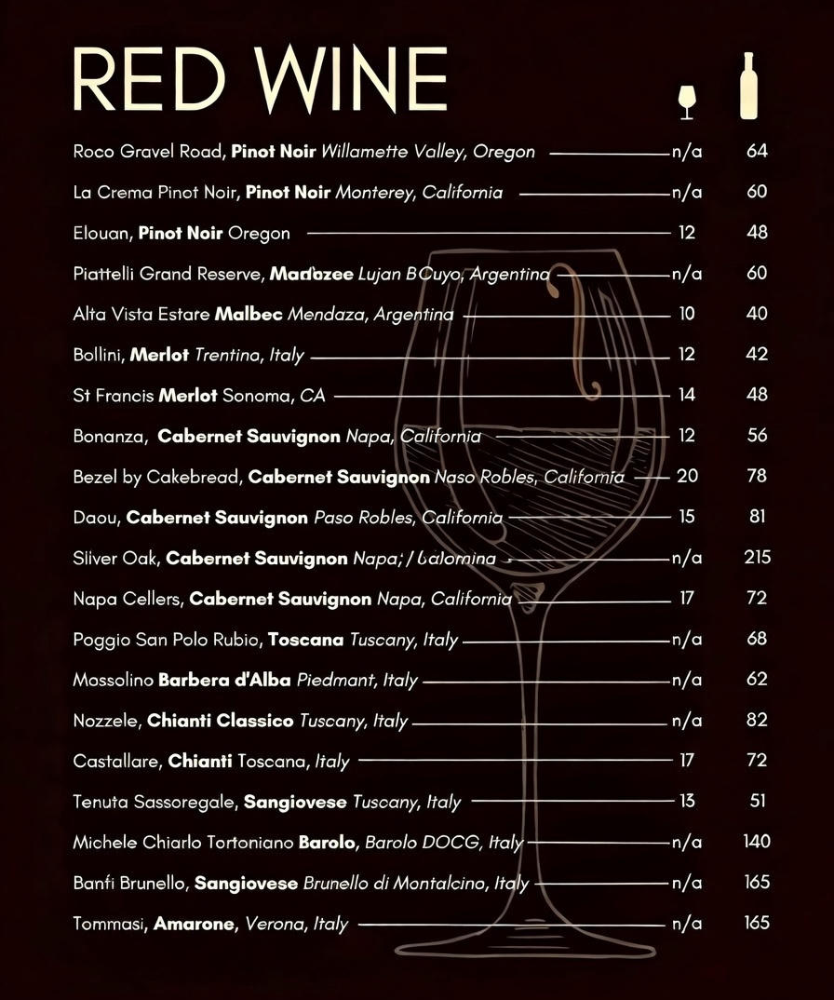
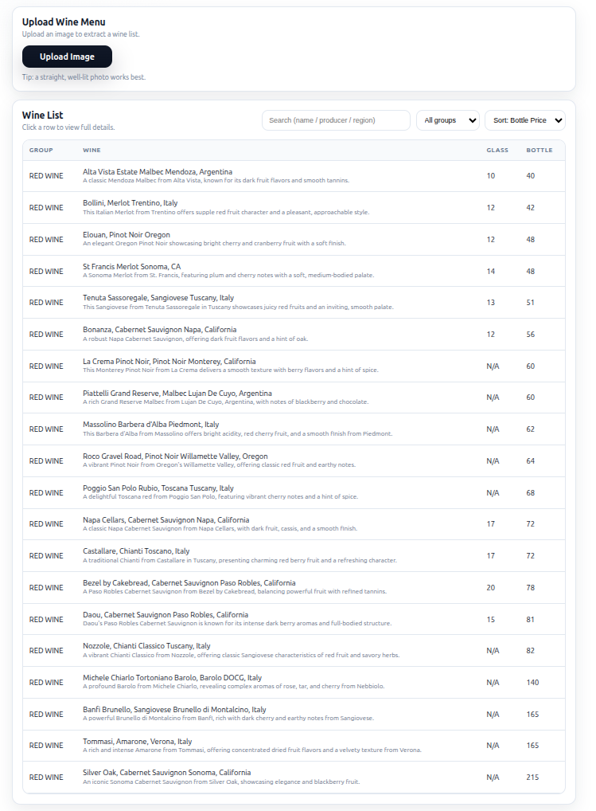
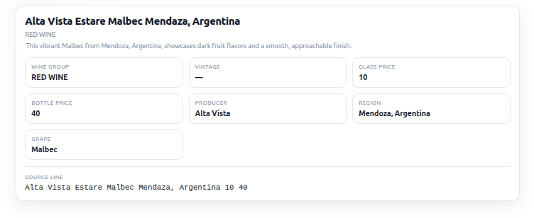
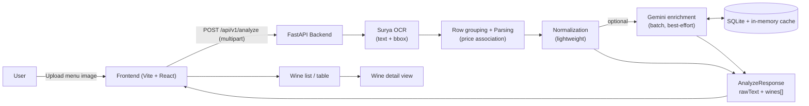

## **Introduction**

This project aims to develop a modern Wine Menu Scanner application by transforming photos of restaurant wine menus into structured, interactive digital wine lists. The core functionality leverages advanced computer vision and natural language processing techniques to handle real-world challenges such as varied menu layouts, poor image quality (e.g., due to lighting or angles), stylized fonts, and multilingual content commonly found in wine menus (e.g., French, Italian, or Spanish terms).

### Example

**Input menu (Example):**



**Result after analyzing:**

After you upload the menu photo, the backend runs OCR and geometry-aware parsing to turn noisy menu text into structured wine rows. The UI then renders:


- A **detail view** when you click a row, showing the full wine record.



- A **clean wine list/table** with the best-effort extracted fields (name, producer/region/grape/vintage when present, price when detected).

If LLM enrichment is enabled, missing fields (producer/region/grape/vintage/short description) may be filled in **best-effort** and cached; otherwise those fields remain blank.



**Process (upload → OCR → parse → enrich → UI):**


What the Wine Menu Scanner Will Do

The Wine Menu Scanner is a modern application that converts photos of restaurant wine menus into structured, searchable, and interactive digital wine lists. It replaces a manual or legacy system by automating menu digitization, wine identification, and data enrichment.

At a High Level, the System Will:

1. Capture Menu Images
- Users (staff or customers) upload images via the web.

---

2. Extract Text and Structure
- Optical Character Recognition (OCR) reads the menu text.
- AI models identify logical sections such as:
  - Wine name  
  - Producer  
  - Region  
  - Vintage  
  - Grape variety  
  - Bottle / glass price  
  - Menu sections (Red, White, Sparkling, Rosé, Dessert)

---

3. Normalize and Clean Data
- Correct spelling errors from OCR
- Standardize formats  
  - Example: “Château Margaux 2018” vs “Margaux, Chateau – 2018”
- Resolve missing or ambiguous fields

---

4. Enrich Wine Information
- Match wines against Gemini API
- Add:
  - Tasting notes
  - Grape composition
  - Region maps
  - Food pairing suggestions
  - Average market price
  - Winery background

---

5. Generate an Interactive Digital Menu
- Display wines in a clean, web-friendly table
- When users click to each row, it will display all the full information of the wine
- Users are able to search, filter, and explore wines by attributes.

## **Requirements**

### 1) Product Goals (Keep It Simple + Fast)
- ✅ **MVP-first:** deliver the smallest feature set that converts **one menu image** into a usable digital wine list.
- ✅ **Performance-first:** optimize for the shortest time from upload → results.
- ✅ **Low complexity:** avoid multi-step workflows, account systems, and advanced configuration unless explicitly required later.

### 2) Scope (MVP)
#### In scope
- ✅ Upload **1 image at a time** via the web UI.
- ✅ Run OCR + parsing to extract wine entries and their attributes.
- ✅ Display results as a **fancy, white-theme** interactive list.
- ✅ Provide row click → detailed wine view.
- ✅ Provide search + filtering + basic exploration.
- ✅ Provide a **Back to list** button from the detail view.

#### Out of scope (for MVP)
- Multi-image upload, PDF import, multi-page stitching.
- User accounts/roles and admin consoles.
- Restaurant management, multi-venue catalogs, and sharing/QR flows.
- Manual review/approval workflow (can be added later if needed).

### 3) Functional Requirements
#### 3.1 Upload
- ✅ The UI must provide a single primary CTA: **“Upload Image”**.
- ✅ Users can upload **exactly one image per analysis run**.
- ✅ Supported formats (MVP): **.jpg, .jpeg, .png**.
- ✅ The user should see an **in-progress state** during analysis (e.g., spinner + status text).
- ✅ If analysis fails, the user sees a clear error message and can re-upload.

#### 3.2 Extraction & Structuring
- ✅ The system must extract and structure each wine entry into a consistent object.
- ✅ Minimum fields to extract when present in the menu:
  - ✅ **Wine name**
  - ✅ **Producer** (if listed)
  - ✅ **Region / appellation** (if listed)
  - ✅ **Vintage** (if listed)
  - ✅ **Grape variety** (if listed)
  - ✅ **Price**: bottle price and/or glass price (if listed)
  - ✅ **Menu section** (e.g., Red/White/Sparkling/Rosé/Dessert)
- ⬜ If a field is missing or ambiguous, it must be left blank and flagged internally as “unknown” rather than guessed.

#### 3.3 Normalization (Lightweight)
- ✅ Apply minimal, fast normalization:
  - ✅ Trim whitespace, normalize common punctuation, standardize currency symbols when obvious.
  - ✅ Normalize vintage to a 4-digit year when confidently detectable.
- ✅ Preserve the original extracted text for troubleshooting.

#### 3.4 Enrichment (Optional / Best-Effort)
- ⬜ If enabled, match wines against **Gemini API** to enrich entries.
- ⬜ Enrichment should be **non-blocking** where possible (do not delay initial list rendering unnecessarily).
- ⬜ Enrichment fields (optional): tasting notes, grape composition, food pairings, average market price, winery background.
- ⬜ If no confident match is found, the system must show “No enrichment available” without breaking the UI.

### 4) UI / UX Requirements (Fancy White Theme)
#### 4.1 Overall
- ✅ UI must be **modern, white theme**, with clear typography, spacing, and subtle shadows.
- ✅ The app must be usable on desktop.

#### 4.2 Primary screens
1. **Upload Screen**
   - ✅ Upload button (single image).
   - ✅ Shows accepted formats notice.
2. **Results List Screen (Wine List)**
   - ✅ Display wines in a **table or card list** with key columns:
     - ⬜ Name, Producer, Region, Vintage, Price (bottle/glass), Section
   - ✅ Each row/card is clickable.
   - ✅ Search box (keyword search across name/producer/region).
   - ⬜ Filters (at minimum): Section, Region, Grape, Vintage range, Price range (when available).
   - ✅ Sorting (at minimum: Name, Vintage, Price.
3. **Wine Detail Screen (Single Wine View)**
   - ⬜ Shows full extracted + enriched information.
   - ✅ Must include a visible **“Back to list”** button that returns to the same scroll position / filter state when feasible.

#### 4.3 States
- ✅ Loading state during upload/analysis.
- ✅ Empty state when no wines found.
- ✅ Error state for OCR/API failures.

### 5) Performance Requirements
- ✅ The system should aim to show the **first usable list** as soon as extraction is complete.
- ✅ Prefer fast, lightweight models and minimal post-processing.
- ✅ Avoid unnecessary round trips; batch external calls when feasible.

### 6) Data Output (Internal)
- ✅ The system should produce a structured list of wine objects (JSON) that the UI renders.
- ✅ Each wine entry should include:
  - ✅ `id`
  - ✅ `rawText` (source line/fragment)
  - ✅ extracted fields (name/producer/region/vintage/grape/prices/section)
  - ⬜ optional enrichment fields
  - ⬜ optional confidence scores (simple 0–1 scale) if available

## **High Level Design**

### Scaling roadmap (production-ready + mobile-friendly)

This MVP is intentionally simple (single FastAPI service + React UI). To scale it into a production system (including native smartphone apps), the evolution path is:

- **Stateless API tier**
  - Keep the backend stateless so it can scale horizontally behind a load balancer.
  - Store any persistent data (jobs, results, user settings) in external stores.

- **Async job processing for large uploads / peak traffic**
  - Move OCR + parsing into background jobs (queue-based) to avoid long HTTP requests.
  - Typical pattern: API returns a `jobId` immediately; clients poll or receive websocket/push updates.

- **Dedicated OCR/ML inference service**
  - Split OCR/inference into a separate service and keep the API service lightweight.
  - Enables independent scaling (CPU pool for OCR, optional GPU pool for advanced models).

- **Caching + content-addressed storage**
  - Hash the uploaded image and cache OCR/parse outputs to avoid re-processing identical menus.
  - Store uploads/results in object storage (e.g., S3-compatible) instead of local disk.

- **Mobile (smartphone) support options**
  - **On-device pre-processing**: crop/rotate/deskew and compress before upload to reduce latency and bandwidth.
  - **On-device extraction (optional)**: run a lightweight on-device OCR/VLM for instant preview on iOS/Android/iPad, then sync structured JSON to the backend.
  - **Hybrid**: on-device detects regions (sections/prices), backend performs full OCR + parsing for consistency.

- **Observability + quality control**
  - Add request tracing, OCR latency metrics, and parse success rates.
  - Add a human review UI for edge cases (optional) and use collected corrections to tune heuristics/models.

- **Security and multi-tenant readiness**
  - Add auth (JWT/OAuth), rate limiting, upload quotas, and per-restaurant separation.

## Architecture diagram



### Architecture overview

The MVP is a simple **monorepo** with a FastAPI backend and a Vite/React frontend:

- **Frontend (React + Vite)**
  - Provides a single-page flow: **Upload → Results list → Wine detail**.
  - Calls the backend `/api/v1/analyze` endpoint and renders the returned JSON.

- **Backend (FastAPI)**
  - Accepts an uploaded image, runs OCR, parses/normalizes into structured `Wine` objects, and returns JSON.
  - Optionally enriches missing fields using Gemini in a single batched call (best-effort), with caching.

### Data flow (end-to-end)

1. **Upload**
   - User uploads one menu image in the UI.
   - Frontend sends a `multipart/form-data` request to `POST /api/v1/analyze`.

2. **OCR**
   - Backend runs **Surya OCR** to extract text + geometry.
   - OCR output is cleaned to reduce noise (menus often contain separators, artifacts, etc.).

3. **Geometry-aware grouping + parsing**
   - OCR tokens are grouped into human-like rows using bounding-box overlap.
   - The parser converts rows into wine candidates and associates prices with the correct wine lines.

4. **Normalization**
   - Lightweight cleanup (trim whitespace, normalize punctuation, normalize vintages when confidently detectable).

5. **(Optional) LLM enrichment + caching**
   - If `ENABLE_GEMINI_ENRICHMENT=true`, the backend sends a **single batched Gemini request** for missing fields.
   - Results are cached (in-memory + SQLite) to avoid repeated LLM calls for the same wine names.
   - Enrichment is best-effort; failures (quota/rate limits/invalid JSON) do not block the main flow.

6. **Response**
   - Backend returns an `AnalyzeResponse` containing:
     - `rawText` (for debugging/troubleshooting)
     - `wines[]` (structured, UI-ready wine objects)

7. **UI rendering**
   - The frontend renders a searchable/sortable list and a detail view per wine.

### Key components

#### Backend modules
- `backend/app/api/v1/routes.py`: `/analyze` endpoint and request/response wiring.
- `backend/app/services/ocr.py`: Surya OCR integration + text cleanup + bbox grouping.
- `backend/app/services/parser.py`: converts OCR text into structured wine rows.
- `backend/app/services/normalize.py`: lightweight normalization.
- `backend/app/services/enrich_gemini.py`: optional Gemini batched enrichment + cache.
- `backend/app/models/wine.py`: Pydantic models (`Wine`, `Price`, `AnalyzeResponse`).

#### Frontend modules
- `frontend/src/components/UploadCard.tsx`: upload UI + progress state.
- `frontend/src/components/WineTable.tsx`: list view (search/sort + display).
- `frontend/src/components/WineDetail.tsx`: detail view.
- `frontend/src/api/client.ts`: backend API calls.

### Operational notes
- **Local dev**: `start-backend.sh` runs uvicorn. Reload is optional via `BACKEND_RELOAD=1`.
- **No database for the core MVP**: only optional SQLite caching for Gemini enrichment.

## **File Structure**

Monorepo layout (simple MVP): FastAPI backend + Vite/React frontend. Results are **in-memory** (no DB) for now.

```
wine-menu-scanner/
├── backend/
│   ├── app/
│   │   ├── main.py                # FastAPI entrypoint (routes + app wiring)
│   │   ├── api/
│   │   │   └── v1/
│   │   │       └── routes.py       # /analyze endpoint (upload image → JSON)
│   │   ├── services/
│   │   │   ├── ocr.py              # Local OCR wrapper (fast, minimal)
│   │   │   ├── parser.py           # Convert OCR text → structured wine rows
│   │   │   ├── normalize.py        # Lightweight normalization
│   │   │   └── enrich_gemini.py    # Optional enrichment (best-effort)
│   │   ├── models/
│   │   │   └── wine.py             # Pydantic models: Wine, Price, etc.
│   │   └── utils/
│   │       └── image.py            # Image loading / resizing helpers
│   ├── requirements.txt           # Python deps
│   └── README.md                  # Backend setup + run instructions
│
├── frontend/
│   ├── index.html
│   ├── src/
│   │   ├── main.tsx                # React bootstrap
│   │   ├── App.tsx                 # High-level routing/state (Upload → List → Detail)
│   │   ├── api/
│   │   │   └── client.ts           # Calls backend /analyze
│   │   ├── components/
│   │   │   ├── UploadCard.tsx       # Single upload button + progress
│   │   │   ├── WineTable.tsx        # Fancy list view with search/filter/sort
│   │   │   ├── WineDetail.tsx       # Detail view + Back to list
│   │   │   └── FiltersBar.tsx       # Minimal filters UI
│   │   ├── styles/
│   │   │   └── theme.css           # White theme styling
│   │   └── types/
│   │       └── wine.ts             # Shared frontend types matching backend JSON
│   ├── package.json
│   ├── vite.config.ts
│   └── README.md                  # Frontend setup + run instructions
│
├── start-backend.sh               # Starts FastAPI (creates venv, installs deps, runs uvicorn)
├── start-frontend.sh              # Starts Vite dev server (npm install, npm run dev)
├── start-all.sh                   # Convenience: backend (bg) + frontend (fg)
├── README.md                      # Root overview: how to run backend + frontend
└── .gitignore
```

Notes (MVP constraints):
- **In-memory only:** the backend returns JSON for the current upload; nothing is persisted.
- **Optional enrichment:** implemented as a separate service so it can be disabled or run after initial results.
- Startup scripts are for **local development convenience** and keep the setup steps minimal.

## **Tools and Technologies**

This stack is intentionally small and fast for the MVP.

### Backend (Python)
- **FastAPI**: lightweight API server for `/analyze`.
- **Pydantic**: request/response validation and typed wine models.
- **Uvicorn**: fast ASGI server for local dev.
- **Local OCR:**
  - **PaddleOCR** (primary) for better accuracy on stylized fonts and real-world photos.
- **Image processing:**
  - **Pillow (PIL)** for loading/resizing/rotation fixes.
  - (Optional) **OpenCV** only if needed for deskew/denoise; avoid by default to keep it lean.
- **Gemini enrichment (optional):**
  - Google **Gemini API** client (only enabled when enrichment is turned on).

### Frontend (Web UI)
- **Vite + React + TypeScript**: fast dev/build, clean component model.
- **Styling (pick one):**
  - **Tailwind CSS** for rapid “fancy white theme” UI, **or**
  - Plain CSS modules + a small design system (keep dependencies minimal).
- **Data table / list UI:**
  - Implement with simple React components first (search/filter/sort in-memory).
  - Add a table library later only if needed.

### Data Format (Contract)
- **JSON over HTTP** between frontend and backend.
- Shared Wine shape mirrored as:
  - Backend: Pydantic models
  - Frontend: TypeScript types

### Dev / Ops (MVP)
- **Monorepo**: `backend/` + `frontend/` in one repository.
- **Environment variables** for secrets (only needed if Gemini enabled).
- **No database** for MVP (in-memory only).

## Start (local)
- Backend: `./start-backend.sh`
- Frontend: `./start-frontend.sh`
- Both: `./start-all.sh`

## Optional: Gemini enrichment

You can optionally enrich missing fields (producer, region, grape, vintage) using Gemini.

1) Create `backend/.env` from the template:
- Copy `backend/.env.example` to `backend/.env`

2) Set:
- `ENABLE_GEMINI_ENRICHMENT=true`
- `GEMINI_API_KEY=...`
- (optional) `GEMINI_MODEL=gemini-1.5-flash`

Restart the backend after changing env vars.
